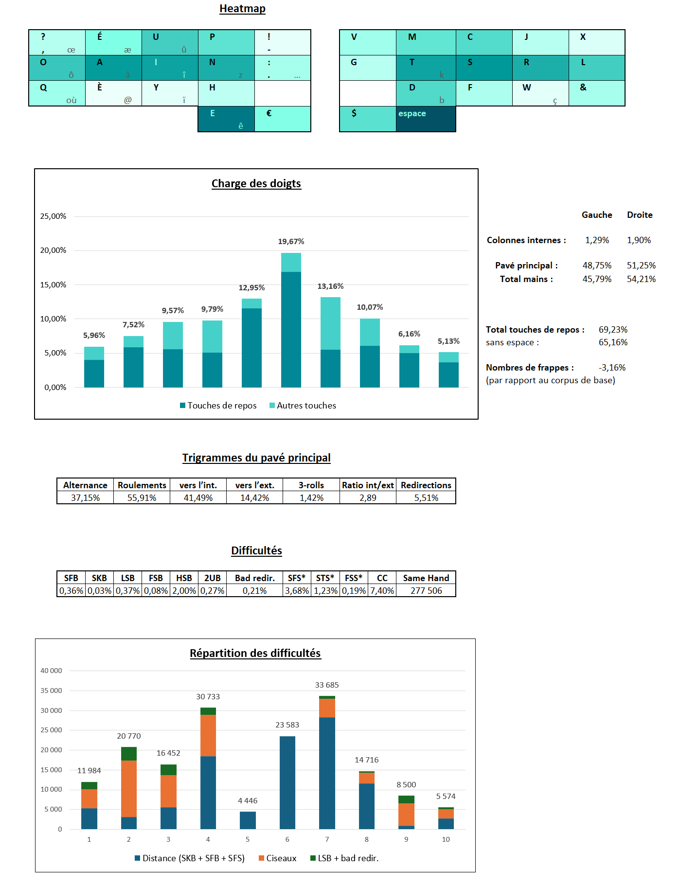

# Kawalyser

C’est mon analyseur personnel. Il permet d’obtenir la heatmap, la charge des doigts et des mains, il fait l’analyse des trigrammes et des difficultés inhérentes à une disposition. Il prend en compte l’utilisation d’une [touche morte de type Lafayette](https://ergol.org/presentation/#impeccable-en-fran%C3%A7ais) et de caractères placés sous les pouces. Il est compatible avec les layouts adaptatifs utilisant les touches *Repeat* et *Magic* ainsi que des *Clever Keys*, comme [Propergol](https://github.com/Kawamashi/Propergol) :

&nbsp; 

## Quoi mesurer dans une disposition ?

Selon moi, une disposition doit être analysée selon 3 axes principaux : la heatmap/charge des doigts, les bigrammes et enfin les trigrammes.

### La heatmap et la charge des doigts
Dans l’idéal, **les touches les plus utilisées doivent être placées sur les meilleurs emplacements** : les 8 touches de repos du pavé principal, mais aussi les 2 touches en dessous des touches de repos des index, les 2 touches au-dessus des touches de repos des majeurs, et sous les pouces. Pour illustrer ça, voilà la [carte d’accessibilité](https://colemakmods.github.io/mod-dh/model.html) qui a servi pour la conception du *Colemak mod DH* (le précurseur des layouts alternatifs modernes) :

 

Je suis globalement d’accord avec cette carte, mais **l’accessibilité des touches reste quelque chose de très personnel** : mes auriculaires ne sont pas plus fragiles que ça mais je n’aime pas trop faire travailler mes annulaires. Je trouve que par rapport à la touche de repos des auriculaires, la touche en dessous est plus accessible que la touche au-dessus, et ça se ressent sur toutes mes dispositions. Pour certaines personnes, c’est l’inverse. De même, les scores de la touche au-dessus de la touche de repos des index et de la touche à l’intérieur (notée 2.2 et 2.9 respectivement) sont très subjectifs.

La charge des doigts est également à prendre en compte : dans l’idéal, **les doigts forts (pouces, index et majeurs) doivent être plus utilisés que les doigts faibles (annulaires et auriculaires)**. Il faut noter qu’il vaut mieux éviter les appuis successifs avec les pouces et les auriculaires.

Utiliser le 2e pouce pour taper un caractère très utilisé apporte un vrai bonus sur ces 2 aspects : on utilise une touche de repos supplémentaire, ce qui permet d’avoir une heatmap plus équilibrée et de mieux répartir la charge des doigts. 

Enfin, il ne faut pas que la charge de travail des mains soit déséquilibrée. Plus particulièrement, une bonne disposition ne doit pas faire travailler une seule main pendant de longues séquences, qui génèrent de la fatigue inutile.

&nbsp; 

### Analyse des bigrammes
Un bigramme est un enchainement de deux touches. Une bonne disposition doit éviter les bigrammes inconfortables. Parmi ceux-ci, on peut distinguer : 

-	Les **SFB** : *Same-Finger Bigram*, deux touches différentes à enchainer avec le même doigt.  
-	Les **SKB** : *Same-Key Bigram*, répétition d’une même touche (ex : `LL` en AZERTY). Le nombre de SKB peut augmenter avec l’utilisation d’une [touche morte de type Lafayette](https://ergol.org/presentation/#impeccable-en-fran%C3%A7ais) (ex : en Ergo-L, `ÉS` provoque un SKB).  
-	Les *ciseaux* (**FSB**), *demi-ciseaux* (**HSB**) et *row-jump bigrams* (**RJB**) : enchainement plus ou moins inconfortable de deux touches sur des rangées différentes. La définition des ciseaux n’est pas la même pour tout le monde. Pour en savoir plus, je conseille de lire le [chapitre correspondant](https://docs.google.com/document/d/1W0jhfqJI2ueJ2FNseR4YAFpNfsUM-_FlREHbpNGmC2o/edit?tab=t.3j7hpqkn3etl) du Keyboard layouts doc. De manière complémentaire aux ciseaux, je mesure les bigrammes “saut de ligne” (RJB). Ce sont des bigrammes dont l’une des deux lettres est sur la rangée du haut et l’autre sur celle du bas, avec les doigts qui “se plient dans le bon sens” (ex : l’index en bas et le majeur en haut).  
-	Les **LSB** : *Lateral Stretch Bigram*, enchainement de deux touches avec une touche d’une des colonnes internes (ou externes, pour les layouts utilisant deux colonnes dédiées aux auriculaires). Cf [ici](https://docs.google.com/document/d/1W0jhfqJI2ueJ2FNseR4YAFpNfsUM-_FlREHbpNGmC2o/edit?tab=t.i8oe0bwffr95).

&nbsp; 

### Analyse des trigrammes

Un trigramme est un enchainement de trois touches. Leur analyse permet de se faire une idée du comportement général de la disposition, ainsi que d’éviter les trigrammes inconfortables.  

#### Comportement général de la disposition
On peut classer les trigrammes en quatre catégories : 

-	Les **alternances** : quand on appuie sur la première touche avec une main, sur la 2e avec l’autre main, et sur la 3e avec la première main. Ex : `PAI` en AZERTY.
-	Les **roulements** : quand la 1ère et la 2e touche sont sur la même main mais pas la 3e, ou quand la 2e et la 3e touche sont sur la même main, mais pas la 1ère. Ex : `FOU` et `IOD` en AZERTY.
-	Les **3 rolls** (également appelés **onehand** par certains analyseurs) : quand les 3 touches sont sur la même main et qu’elles vont dans le même sens. Ex : `REA` en AZERTY.
-	Les **redirections** : quand les 3 touches sont sur la même main, avec un changement de direction au milieu. Ex : `PIL` et `ILU` en AZERTY.

Ces quatre catégories sont liées, l’alternance s’opposant aux trois autres. **Quand une disposition favorise l’alternance des mains, elle fait “mécaniquement” baisser les roulements, les 3 rolls et les redirections. La réciproque est vraie.**

De manière générale, une disposition favorisant l’alternance des mains donnera l’impression d’un travail des doigts plus régulier, plus uniforme, alors qu’une disposition favorisant les roulements aura certains mots très simples à taper, “glissant sous les doigts” en quelque sorte, tandis que d’autres paraitront peu évidents à taper.

Dans ces catégories, on peut distinguer les roulements et 3 rolls vers l’intérieur de ceux vers l’extérieur. Certaines personnes préfèrent les roulements vers l’intérieur, d’autres ne sont pas sensibles à la direction des roulements. De même, certaines personnes détestent les redirections, alors que d’autres les trouvent acceptables.

Personnellement, j’apprécie une disposition avec beaucoup de roulements vers l’intérieur mais je vais ensuite privilégier l’alternance aux roulements vers l’extérieur et aux 3 rolls, et je cherche à minimiser les redirections. 

L’analyse des trigrammes est complémentaire de celle des bigrammes. Elle est importante, elle permet notamment d’éviter de considérer les redirections comme des enchainements de bigrammes. Ce concept n’existait pas quand le Colemak et le BÉPO ont été créés. Pour plus d’infos, je conseille la lecture de [ce chapitre](https://docs.google.com/document/d/1W0jhfqJI2ueJ2FNseR4YAFpNfsUM-_FlREHbpNGmC2o/edit?tab=t.6r1v629nms0d). 

#### Difficultés liées aux trigrammes
On peut également se servir de l’analyse des trigrammes pour détecter d’autres difficultés que celles ayant déjà été détectées avec les bigrammes. Par exemple, les redirections n’impliquant ni le pouce ni l’index sont qualifiées de **mauvaises redirections**. Ce sont des enchainements inconfortables. 

De même, on peut étendre le concept de SFB avec une touche tapée avec un autre doigt entre les 2 : cela donne les **SFS** (*Same Finger Skipgrams*). Ex : `JEU` en AZERTY. Les SFS ne sont pas bien évidemment pas aussi problématiques que les SFB, mais il faut éviter d’en avoir trop, pour que les doigts aient le temps de se replacer entre 2 frappes. Je distingue un type particulier de SFS : les **STS** (*Same Thumb Spacegrams*), quand le premier ou le dernier caractère est un espace.
De la même manière, je cherche les **FSS** (*Full Scissors Skipgrams*), un ciseau avec une touche tapée par un autre doigt entre les 2.

**La gêne occasionnée par les skipgrams est plus importante si les trois lettres sont tapées avec la même main que si la lettre du milieu est tapée avec l’autre main.** Par conséquent, les skipgrams issus d’une alternance de mains ne comptent pas autant que les skipgrams issus d’une redirection pour mon analyseur.

&nbsp; 

### Autres points à analyser

#### Charge cognitive
L’objectif d’une disposition ergonomique est de rendre la frappe aussi confortable que possible. Pour cela, on arrange au mieux les différents caractères. Ergo-L va plus loin grâce à sa [touche morte de type Lafayette](https://ergol.org/presentation/#impeccable-en-fran%C3%A7ais). On peut aller encore plus loin en exploitant les possibilités offertes par un clavier programmable, comme par exemple :

-	La touche [Repeat](https://docs.qmk.fm/features/repeat_key) : cette touche produit le dernier caractère tapé. Ça permet de transformer les doubles frappes (comme dans `ELLE`) en enchainements plus confortables. 
-	La touche [Magic](https://getreuer.info/posts/keyboards/alt-layouts/index.html#magic-sturdy) : cette touche produit un caractère ou une série de caractères en fonction du caractère entré précédemment. Elle peut notamment servir à [diminuer les SFB](https://docs.qmk.fm/features/repeat_key#eliminating-sfbs) ou comme raccourci pour des enchainements particulièrement fréquents (`ION`, `MENT`).
-	Les [Clever Keys](https://github.com/Kawamashi/qmk_userspace/blob/main/keyboards/splitkb/kyria/rev1/base/keymaps/Kawamashi/clever_keys.c) : c’est un concept personnel. Mon clavier a un buffer des dernières frappes, les Clever Keys me permettent de changer le résultat de la frappe en cours en fonction de celle-ci et du contenu du buffer. Les Clever Keys me permettent de transformer l’intégralité de mon clavier en touches magiques ! Par exemple, quand je tape une voyelle alors que j’ai tapé `Q` juste avant, le clavier ajoute le `U` automatiquement entre les deux. 

Ce genre d’implémentation permet de diminuer les contraintes mécaniques sur les doigts, mais augmente la charge cognitive lors de la frappe. C’est particulièrement vrai lors de l’apprentissage de la disposition. Cependant, après un certain temps, certaines touches magiques deviennent complètement naturelles, la charge cognitive disparait entièrement ou presque, tandis que d’autres restent “lourdes” pour le cerveau. 

Même une fois que la disposition est acquise, il reste toujours un travail intellectuel supplémentaire comparé à une disposition classique. Il faut donc exploiter ces possibilités intelligemment et ne pas en abuser, quitte à (re)modifier le layout au bout d’un certain temps.

Le pourcentage d’utilisation de la touche morte, des touches Repeat et Magic ainsi que des Clever Keys permet d’avoir une idée grossière de la charge cognitive induite par une disposition.

#### Longues séquences à une main
Une bonne disposition ne doit pas fatiguer inutilement les mains, notamment à cause des redirections mais aussi des longues séquences tapées avec unes seule main. En plus de la mesure des redirections, Kawalyser compte les séquences de quatre caractères ou plus tapés avec la même main. Elles sont notées **SHS** (*Same-Hand Sequence*). 

&nbsp; 

## Kawalyser
Comme je l’ai dit en introduction, Kawalyser permet d’obtenir la heatmap, la charge des doigts et des mains, il fait l’analyse des trigrammes et des difficultés inhérentes à une disposition. Il prend en compte l’utilisation d’une touche morte de type Lafayette (notée `&`). Il peut également prendre en compte l’utilisation de lettres sous les pouces, des touches *Repeat* (notée `$`) et *Magic* (notée `€`) ainsi que des *Clever Keys*.

Kawalyser se présente sous la forme d’un classeur Excel, dans lequel se trouve plusieurs feuilles.

### La feuille *Corpus*
Pas grand-chose à dire, cette feuille contient le corpus et c’est tout. Que ce soit en français ou en anglais, j’ai retenu des corpus tirés de Reddit. Ils sont relativement gros (30 000 lignes), et représentatifs de la manière dont la plupart des gens écrivent au quotidien.

### La feuille *Layout*
C’est sur cette feuille qu’il faut saisir la disposition à analyser (couche Lafayette incluse), ainsi que les éventuelles règles magiques. 

### La feuille *Ngrams refined*
Cette feuille est utile pour analyser un corpus

De plus, Kawalyser permet de se faire une idée des doigts sur lesquels sont concentrées les difficultés. En effet, lorsqu’on tape un ciseau, c’est le dernier caractère qui est pénible pour les doigts. Pour obtenir le graphique résultat, j’affecte des coefficients aux différentes difficultés : un demi-ciseau ne doit pas autant compter qu’un SFB, par exemple ! Je ne prétends pas que cette pondération soit parfaite, mais je pense que le graphique permet de mettre en lumière si les difficultés affectent plus particulièrement les doigts faibles.

Vous trouverez un glossaire de toutes les abréviations utilisées par Kawalyser [ici](Glossaire.md).

Pour l’instant, Kawalyser est codé en VBA, à ma plus grande honte. Je projette de le porter en Python d’ici peu. Vous trouverez les analyses de différents layouts dans ce repo. 

N’hésitez pas à me contacter pour toutes questions ou suggestions !
